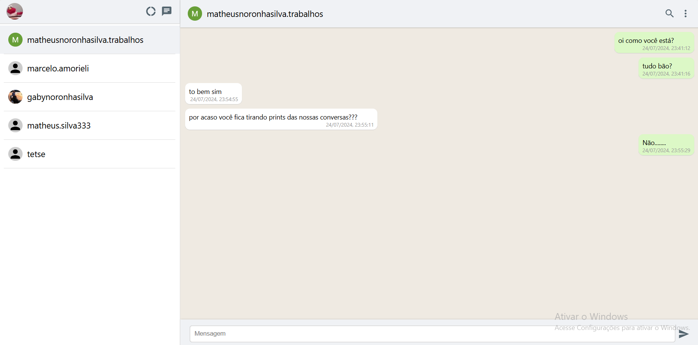

Utilizção do ReactJS e firebase.

Montagem de um chat apenas de conversas de texto, utilizando um banco de dados Cloud Firestore.

Para inicializar o projeto deve-se escrever yarn start ou npm start no terminal

